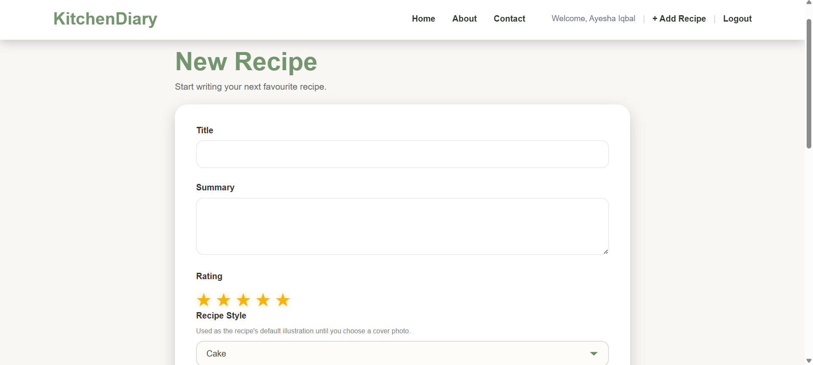
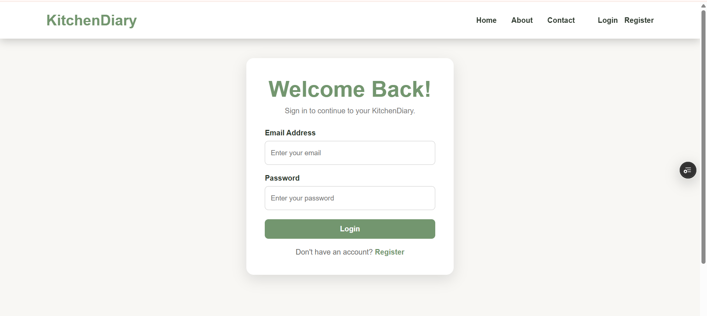

# 🍽️ KitchenDiary

A modern full-stack recipe management application that allows users to securely store, organize, and manage their favorite recipes from anywhere.

KitchenDiary provides a clean and responsive interface for creating recipes, organizing ingredients, managing preparation steps, uploading recipe images, and searching recipes with ease.

---

## 🌐 Live Demo

**Website:**  
https://kitchen-diary-lovat.vercel.app/

**API Documentation (Swagger):**  
https://kitchendiary-w72v.onrender.com/swagger/index.html

**GitHub Repository:**  
https://github.com/ayeshaiqbal09/KitchenDiary

---

# ✨ Features

- 🔐 User Registration & Login
- 🔑 JWT Authentication
- 🍲 Create, Edit & Delete Recipes
- 🥕 Manage Ingredients
- 📝 Add Cooking Steps
- 🏷️ Recipe Tags
- ⭐ Recipe Ratings
- 🔍 Search Recipes
- 🖼️ Upload Recipe Images
- ☁️ Cloudinary Image Hosting
- 📱 Responsive Design
- 🌍 Fully Deployed Application

---

# 📸 Screenshots

> 

### Home Page


---

### Recipe Details



### Register Page

![Register Page].(screenshots/register.png)

---

### Login



---

# 🛠️ Tech Stack

## Frontend

- Angular 21
- TypeScript
- HTML5
- CSS3

## Backend

- ASP.NET Core Web API
- C#
- Entity Framework Core
- ASP.NET Identity
- JWT Authentication

## Database

- PostgreSQL

## Cloud Storage

- Cloudinary

## Deployment

- Render (Backend)
- Vercel (Frontend)
- Docker

---

# 🏗️ System Architecture

```
                 Angular 21
                      │
                      ▼
          ASP.NET Core Web API
                      │
      ┌───────────────┴───────────────┐
      ▼                               ▼
 PostgreSQL                     Cloudinary
```

---

# 📂 Project Structure

```
KitchenDiary
│
├── Backend
│   └── KitchenDiary.API
│
├── Frontend
│   └── kitchen-diary-ui
│
└── README.md
```

---

# 🔐 Authentication

KitchenDiary uses JWT (JSON Web Tokens) for secure authentication.

Authenticated users can:

- Create recipes
- Edit recipes
- Delete recipes
- Upload images
- Manage ingredients
- Manage recipe steps
- Manage tags

---

# ☁️ Image Storage

Recipe images are uploaded directly to Cloudinary.

Benefits:

- Faster image delivery
- Persistent storage
- Automatic image optimization
- No local file storage required

---

# 🚀 Getting Started

## Clone Repository

```bash
git clone https://github.com/ayeshaiqbal09/KitchenDiary.git
```

## Backend

```bash
cd Backend/KitchenDiary.API
dotnet restore
dotnet run
```

## Frontend

```bash
cd Frontend/kitchen-diary-ui
npm install
ng serve
```

---

# ⚙️ Environment Variables

The backend requires the following environment variables:

### PostgreSQL

```
ConnectionStrings__DefaultConnection
```

### JWT

```
Jwt__Key
Jwt__Issuer
Jwt__Audience
```

### Cloudinary

```
Cloudinary__CloudName
Cloudinary__ApiKey
Cloudinary__ApiSecret
```

---

# 📚 API Documentation

Swagger UI is available at:

https://kitchendiary-w72v.onrender.com/swagger/index.html

---

# 🚀 Deployment

| Service | Platform |
|----------|----------|
| Frontend | Vercel |
| Backend | Render |
| Database | PostgreSQL (Render) |
| Images | Cloudinary |

---

# 🔮 Future Improvements

- ❤️ Favorite Recipes
- 📅 Meal Planner
- 🛒 Shopping List
- 📤 Recipe Sharing
- 📱 Android APK
- 🍎 iOS Application

---

# 👩‍💻 Author

**Ayesha Iqbal**

GitHub

https://github.com/ayeshaiqbal09

LinkedIn

https://www.linkedin.com/in/ayesha-iqbal-a8a884243

---

If you found this project interesting, feel free to ⭐ the repository.
